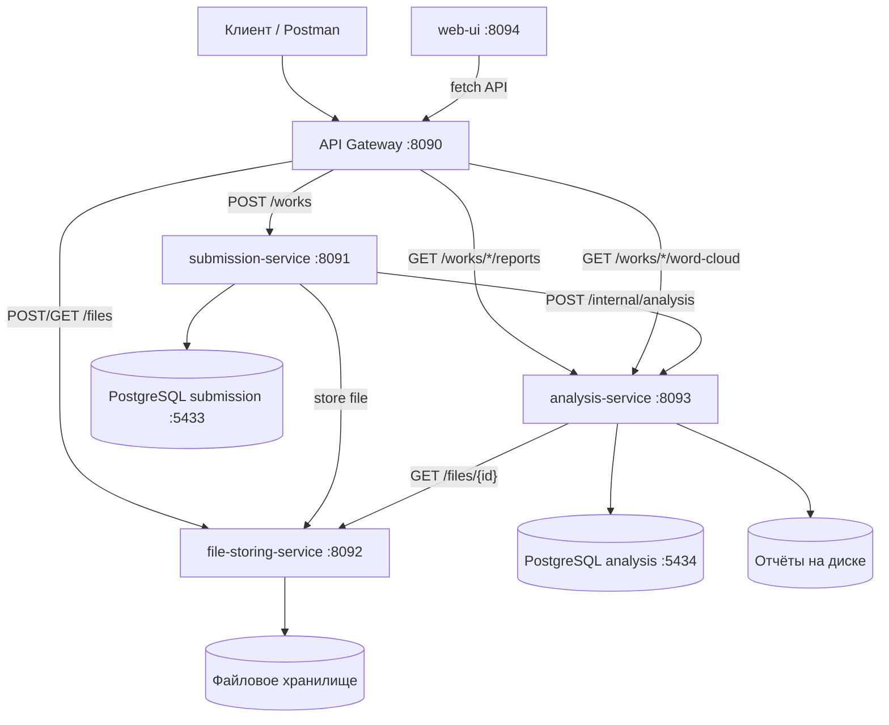
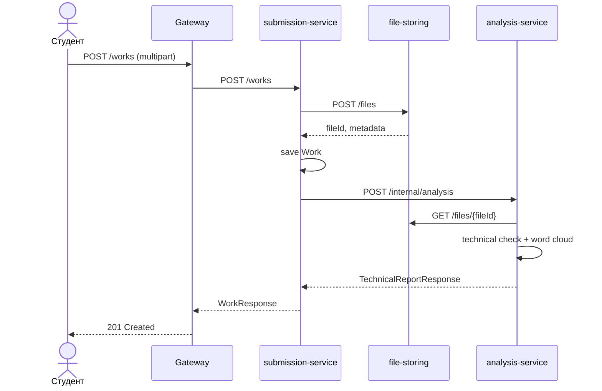
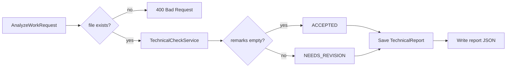
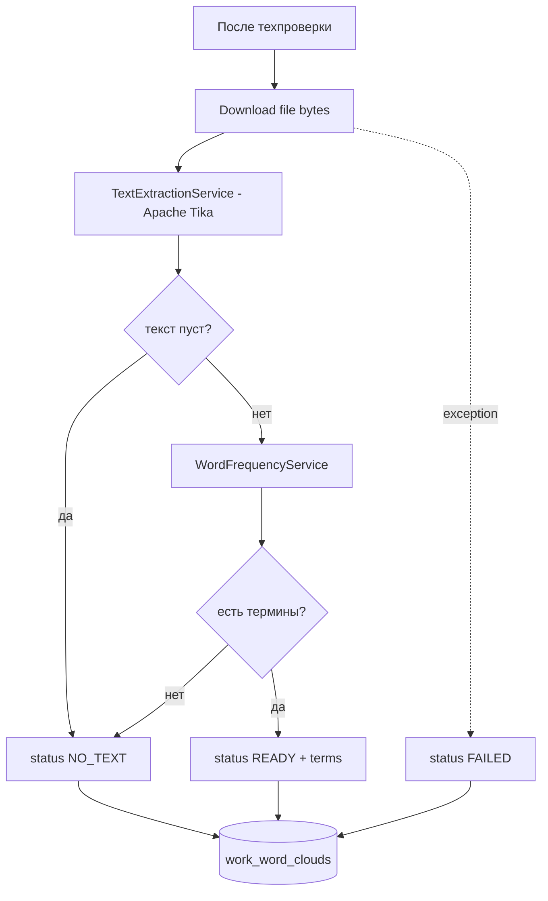
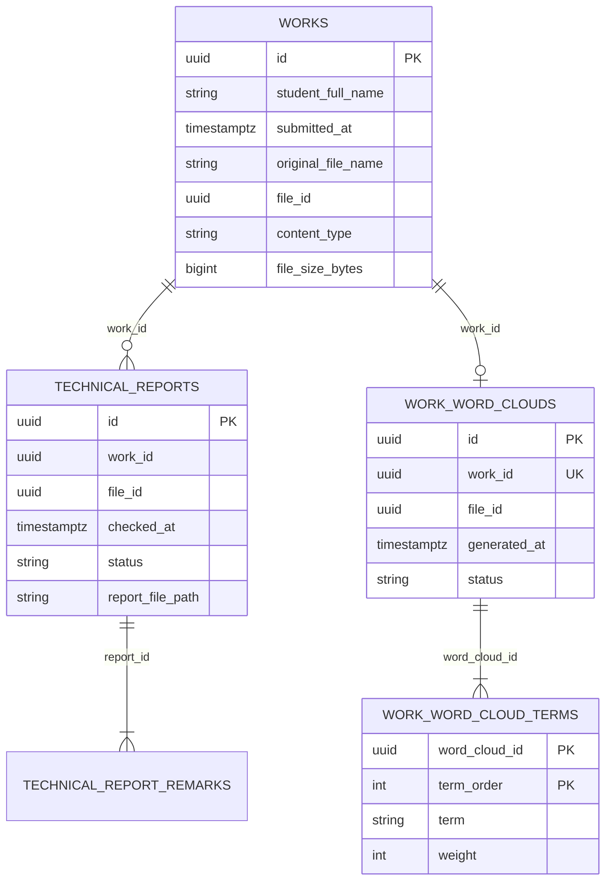

# CosmoScan

Система приёма и первичной обработки студенческих работ: загрузка файла, техническая проверка, формирование отчёта и данных для визуализации в виде облака слов.

---

## Содержание

- [Архитектура](#архитектура)
- [Подробное описание проделанной работы](#подробное-описание-проделанной-работы)
- [Пользовательские сценарии](#пользовательские-сценарии)
- [Технические сценарии взаимодействия сервисов](#технические-сценарии-взаимодействия-сервисов)
- [Модели данных](#модели-данных)
- [Публичное API (через Gateway)](#публичное-api-через-gateway)
- [Сборка и зависимости](#сборка-и-зависимости)
- [Запуск и проверка](#запуск-и-проверка)
- [Веб-портал (web-ui)](#веб-портал-web-ui)
- [Тестирование](#тестирование)
- [Зависимости и лицензии](#зависимости-и-лицензии)
- [Структура репозитория](#структура-репозитория)

---

## Архитектура



| Сервис | Порт | Назначение |
|--------|------|------------|
| **web-ui** | 8094 | Статический портал (nginx): сценарии UC-1–UC-3, ссылки Swagger/health/JaCoCo |
| **gateway** | 8090 | Единая точка входа API, маршрутизация |
| **submission-service** | 8091 | Приём работ, метаданные в БД |
| **file-storing-service** | 8092 | Хранение файлов на диске |
| **analysis-service** | 8093 | Техпроверка, отчёты, облако слов |
| **submission-db** | 5433 | БД работ |
| **analysis-db** | 5434 | БД отчётов и word cloud |

Внутренний эндпоинт `POST /internal/analysis` **не** проксируется через Gateway — к нему обращается только `submission-service`.

---

## Подробное описание проделанной работы

### 1. Микросервисная декомпозиция

Проект разделён на четыре исполняемых модуля Gradle:

- **gateway** — Spring Cloud Gateway, маршруты к сервисам, Swagger UI по префиксам `/swagger/{service}/`.
- **submission-service** — REST API приёма работ (`multipart/form-data`), JPA + Flyway, PostgreSQL.
- **file-storing-service** — загрузка и скачивание файлов, валидация формата и размера, хранение в каталоге на диске.
- **analysis-service** — технический анализ, сохранение отчётов в БД и JSON на диск, построение данных word cloud.

Каждый модуль имеет свой `Dockerfile` и конфигурацию в `docker-compose.yml`. Health-check (`/actuator/health`) в Compose настроен для **submission-service**, **file-storing-service** и **analysis-service** (Spring Actuator). **Gateway** не использует Actuator и в Compose health-check не имеет.

### 2. Сквозной сценарий «Сдать работу»

При `POST /works` выполняется цепочка:

1. Валидация файла (расширение `pdf` / `docx` / `txt`, максимум **1 MB**, запрет ZIP).
2. Сохранение файла в **file-storing-service** → получение `fileId`.
3. Запись метаданных работы в **submission-db** (`workId`, ФИО студента, `fileId`, имя файла, размер, content-type).
4. Синхронный вызов **analysis-service** (`POST /internal/analysis`).
5. В ответ клиенту — `WorkResponse` с кратким техническим отчётом.

### 3. Технический анализ (analysis-service)

- Проверка существования файла в file-storing (`GET /files/{fileId}`).
- **TechnicalCheckService** — проверка метаданных: размер, расширение, content-type (без чтения содержимого).
- Статусы отчёта: `ACCEPTED` / `NEEDS_REVISION` + список замечаний (`remarks`).
- Сохранение отчёта в PostgreSQL и дублирование в JSON-файл (`ReportFileWriter`).

### 4. Облако слов (word cloud)

Реализовано в **analysis-service** при том же вызове analyze:

- Скачивание файла из file-storing.
- Извлечение текста — **Apache Tika 2.9.2** (лицензия Apache-2.0).
- Подсчёт частот слов — собственный **WordFrequencyService** .
- Сохранение в таблицы `work_word_clouds` / `work_word_cloud_terms`.
- Статусы: `READY`, `NO_TEXT`, `FAILED` (ошибка извлечения не отменяет приём работы).

Публичное чтение: `GET /works/{workId}/word-cloud` — JSON с массивом `{ "text", "weight" }` для отрисовки на клиенте (например wordcloud2.js).

### 5. API Gateway

Маршрутизация публичных запросов на порт **8090**:

- `POST /works` → submission-service
- `GET /works/{workId}/reports` → analysis-service
- `GET /works/{workId}/word-cloud` → analysis-service
- `POST /files`, `GET /files/{fileId}` → file-storing-service

### 6. Качество и документация API

- **OpenAPI (springdoc)** на каждом сервисе.
- **Postman** — скрипты проверок в `postman/cosmoscan-api-tests.js`.
- **JaCoCo** — минимум **60%** покрытия строк для `submission-service`, `file-storing-service`, `analysis-service` (задача `check`).
- **web-ui** — одностраничный портал (HTML/CSS/JS + nginx в Docker); визуализация word cloud на клиенте через **wordcloud2.js** (данные считает **analysis-service** в Java).

---

## Пользовательские сценарии

### UC-1. Студент сдаёт работу

**Актор:** студент (или внешняя система)  
**Цель:** загрузить работу и сразу узнать результат техпроверки.

| Шаг | Действие |
|-----|----------|
| 1 | Клиент отправляет `POST /works` на Gateway (`studentFullName` + файл). |
| 2 | Система валидирует файл и сохраняет его. |
| 3 | Система запускает анализ. |
| 4 | Клиент получает `201` с `id` работы, `fileId` и блоком `technicalReport` (`status`, `remarks`). |

**Результат:** работа зарегистрирована; при `NEEDS_REVISION` в `remarks` указаны причины (размер, формат и т.д.).



---

### UC-2. Преподаватель просматривает историю отчётов

**Актор:** преподаватель  
**Цель:** получить все технические отчёты по `workId`.

| Шаг | Действие |
|-----|----------|
| 1 | `GET /works/{workId}/reports` через Gateway. |
| 2 | Ответ — массив отчётов, отсортированных по дате (новые первыми). |

*Примечание:* при обычной сдаче через UC-1 создаётся один отчёт; массив рассчитан на повторные вызовы `POST /internal/analysis` (внутренний сценарий).

---

### UC-3. Визуализация содержания работы (облако слов)

**Актор:** преподаватель / аналитик  
**Цель:** увидеть частотный «срез» текста работы.

| Шаг | Действие |
|-----|----------|
| 1 | После сдачи работы (UC-1) вызвать `GET /works/{workId}/word-cloud`. |
| 2 | При `status: READY` использовать массив `terms` для UI-облака. |
| 3 | При `NO_TEXT` / `FAILED` — показать сообщение пользователю. |

---

### UC-4. Прямая загрузка файла (без привязки к работе)

**Актор:** интегратор / тестировщик  
**Цель:** сохранить файл и получить `fileId`.

| Шаг | Действие |
|-----|----------|
| 1 | `POST /files` с multipart `file`. |
| 2 | `GET /files/{fileId}` — скачивание (через Gateway). |

*Примечание:* полный учебный сценарий предполагает сдачу через UC-1; UC-4 полезен для отладки file-storing.

---

## Технические сценарии взаимодействия сервисов

### TS-1. Синхронная оркестрация при submit

| # | От | К | Метод | Данные |
|---|---|---|--------|--------|
| 1 | submission | file-storing | `POST /files` | `MultipartFile` |
| 2 | submission | analysis | `POST /internal/analysis` | JSON `AnalyzeWorkRequest` |
| 3 | analysis | file-storing | `GET /files/{fileId}` | проверка + скачивание для word cloud |

**AnalyzeWorkRequest** (тело внутреннего вызова):

```json
{
  "workId": "uuid",
  "fileId": "uuid",
  "studentFullName": "string",
  "originalFileName": "work.pdf",
  "contentType": "application/pdf",
  "fileSizeBytes": 12345
}
```

**Отказоустойчивость:** если файл не найден в file-storing, analysis возвращает `400`; submission пробрасывает `400` клиенту. Транзакция JPA в submission **откатывает** запись в `works`, если analyze завершился ошибкой после `save`, но файл в file-storing **уже сохранён** и может остаться без привязки к работе (сиротский артефакт).

---

### TS-2. Техническая проверка (без парсинга текста)



Правила совпадают с валидацией на submission/file-storing: **pdf, docx, txt**, ≤ 1 MiB, без ZIP.

---

### TS-3. Построение word cloud



---

### TS-4. Чтение через Gateway (без submission)

| Запрос клиента | Сервис-получатель | Примечание |
|----------------|-------------------|------------|
| `GET /works/{id}/reports` | analysis-service | Только чтение из analysis-db |
| `GET /works/{id}/word-cloud` | analysis-service | 404 если analyze ещё не вызывался |
| `GET /files/{id}` | file-storing-service | Бинарное тело файла |

submission-service в этих сценариях **не участвует**.

---

### TS-5. Хранение данных по сервисам

Ниже — **логическая** модель (две отдельные БД: `works` в submission-db, отчёты и word cloud в analysis-db; FK между инстансами PostgreSQL нет).



**Вне БД:**

| Сервис | Артефакт | Путь (по умолчанию) |
|--------|----------|---------------------|
| file-storing | файлы работ | `STORAGE_FILES_PATH` / volume Docker |
| analysis | JSON отчётов | `STORAGE_REPORTS_PATH` |

Связь между БД — логическая: общие `workId` и `fileId` (UUID), без FK между PostgreSQL инстансами.

---

## Модели данных

### WorkResponse (ответ на submit)

| Поле | Тип | Описание |
|------|-----|----------|
| `id` | UUID | Идентификатор работы |
| `studentFullName` | string | ФИО |
| `submittedAt` | ISO-8601 | Время сдачи |
| `originalFileName` | string | Имя файла |
| `fileId` | UUID | Ссылка на file-storing |
| `fileSizeBytes` | number | Размер |
| `contentType` | string | MIME |
| `technicalReport` | object | `id`, `status`, `remarks`, `checkedAt` |

### WordCloudResponse

| Поле | Тип | Описание |
|------|-----|----------|
| `workId` | UUID | Работа |
| `fileId` | UUID | Файл-источник |
| `generatedAt` | ISO-8601 | Время расчёта |
| `status` | enum | `READY` \| `NO_TEXT` \| `FAILED` |
| `terms` | array | `{ "text": "...", "weight": N }` |

---

## Публичное API (через Gateway)

Базовый URL: `http://localhost:8090`

| Метод | Путь | Коды | Описание |
|-------|------|------|----------|
| `POST` | `/works` | `201`, `400` | Сдать работу (`studentFullName`, `file`) |
| `GET` | `/works/{workId}/reports` | `200` | Список технических отчётов (может быть пустым) |
| `GET` | `/works/{workId}/word-cloud` | `200`, `404` | Данные для облака слов (`404` — analyze ещё не выполнялся) |
| `POST` | `/files` | `201`, `400` | Загрузить файл |
| `GET` | `/files/{fileId}` | `200`, `404` | Скачать файл |

**Swagger UI (через Gateway, springdoc 2.x):**

- `http://localhost:8090/swagger/submission/swagger-ui/index.html`
- `http://localhost:8090/swagger/files/swagger-ui/index.html`
- `http://localhost:8090/swagger/analysis/swagger-ui/index.html`

---

## Сборка и зависимости

Проект собирается двумя способами: **Docker Compose** (рекомендуется для запуска всей системы) и **Gradle на хосте** (тесты, JaCoCo, локальная разработка без контейнеров).

### Docker Compose (`docker compose up --build`)

Команда **собирает образы** микросервисов и **запускает** все контейнеры. При первом запуске Docker также **скачивает** базовые образы из реестра.

| Шаг | Что происходит |
|-----|----------------|
| 1 | Скачивание образов `postgres:16-alpine`, `eclipse-temurin:17`, `nginx:1.27-alpine` (если их ещё нет локально) |
| 2 | **gateway**, **submission-service**, **file-storing-service**, **analysis-service** — multi-stage сборка: внутри контейнера выполняется `./gradlew :<модуль>:bootJar -x test` |
| 3 | Gradle загружает **зависимости Java** из **Maven Central** (Spring Boot, Spring Cloud Gateway, PostgreSQL driver, Flyway, Apache Tika, springdoc и транзитивные JAR) в кэш сборки Docker-слоя |
| 4 | В runtime-образ попадает только **JRE + готовый JAR**; исходники в финальный образ не копируются |
| 5 | **web-ui** — multi-stage: в JDK-стадии `./gradlew check copyJacocoReportsForWeb` (unit-тесты трёх backend-сервисов, JaCoCo ≥ 60%, HTML в `web-ui/reports/`); в nginx — `index.html`, `assets/`, отчёты |
| 6 | Контейнеры стартуют в порядке `depends_on`; БД и backend ждут `healthy` |

Сборка **web-ui** дольше остальных (прогон тестов). JAR-сервисы по-прежнему собираются с `-x test`, чтобы не дублировать тесты три раза.

Список сервисов и портов — в [архитектуре](#архитектура) и `docker-compose.yml`.

### Зависимости веб-портала (web-ui)

| Компонент | Когда подтягивается | Откуда |
|-----------|---------------------|--------|
| HTML, CSS, JS портала (`app.js`) | Сборка образа `web-ui` | Файлы репозитория → nginx |
| PNG-схемы | Сборка образа `web-ui` | `web-ui/assets/images/` |
| JaCoCo HTML (`/reports/submission`, `files`, `analysis`) | Сборка образа `web-ui` (Gradle `check` + `copyJacocoReportsForWeb`) | Генерируются в Docker, не нужно вручную на хосте |
| **wordcloud2.js** | **При открытии страницы в браузере** | CDN [jsDelivr](https://cdn.jsdelivr.net/npm/wordcloud@1.2.2/src/wordcloud2.min.js) (MIT) |

Отрисовка облака слов — в браузере; **подсчёт терминов** — в **analysis-service** (Java). Данные работ на CDN не отправляются.

Для работы портала **без интернета** wordcloud2 можно включить в образ: положить `wordcloud2.min.js` в `web-ui/assets/vendor/` и изменить `<script src="...">` в `index.html`.

### Сборка на хосте (Gradle)

```bash
# Windows
gradlew.bat build

# Linux/macOS
./gradlew build
```

Загружает те же Maven-зависимости в локальный кэш `~/.gradle`. Задача `check` — тесты и проверка JaCoCo (≥ 60%). Задача `copyJacocoReportsForWeb` копирует HTML-отчёты в `web-ui/reports/` для раздела JaCoCo на портале.

Для запуска JAR без Docker нужны локальные PostgreSQL и переменные из `application.yml` (см. [локальная разработка](#локальная-разработка-без-docker)).

---

## Запуск и проверка

### Требования

- **Docker Compose** — для полного стека (JDK на хосте не обязателен)
- **JDK 17+** и **Gradle (gradlew)** — для тестов и сборки без Docker

### Docker Compose

Из корня репозитория:

```bash
# Сборка образов и запуск всех сервисов (логи в консоли)
docker compose up --build

# То же в фоне
docker compose up --build -d

# Остановка
docker compose down

# Остановка и удаление томов БД/файлов
docker compose down -v
```

**Windows (PowerShell):** те же команды; при локальной сборке без Docker — `gradlew.bat` вместо `./gradlew`.

Дождитесь статуса `healthy` у **submission-service**, **file-storing-service**, **analysis-service** и обеих БД (`docker compose ps`). **gateway** и **web-ui** будут в состоянии `running` (отдельного health-check в Compose для них нет).

| URL | Назначение |
|-----|------------|
| http://localhost:8094 | Веб-портал |
| http://localhost:8090 | API Gateway (запросы с портала и Swagger) |

Проверка backend-сервисов:

```bash
curl http://localhost:8091/actuator/health
curl http://localhost:8092/actuator/health
curl http://localhost:8093/actuator/health
```

Проверка через Gateway (после старта всех контейнеров — ожидается HTML Swagger UI):

```bash
curl http://localhost:8090/swagger/submission/swagger-ui/index.html
```

### Локальная разработка (без Docker)

1. Поднять PostgreSQL (значения по умолчанию из `application.yml`):

| Инстанс | Порт | Database | User / Password |
|---------|------|----------|-----------------|
| submission | 5433 | `cosmoscan_submission` | `cosmoscan` / `cosmoscan` |
| analysis | 5434 | `cosmoscan_analysis` | `cosmoscan` / `cosmoscan` |

2. Запустить сервисы по порядку: file-storing → analysis → submission → gateway.
3. Переменные окружения — см. `application.yml` в каждом модуле.

### Пример: сдача работы

```bash
curl -X POST http://localhost:8090/works \
  -F "studentFullName=Ivan Ivanov" \
  -F "file=@test.txt"
```

```bash
# подставьте UUID из поля id ответа POST /works
curl http://localhost:8090/works/00000000-0000-0000-0000-000000000001/word-cloud
```

---

## Веб-портал (web-ui)

Каталог `web-ui/` — статический портал на **nginx** (контейнер `web-ui`, порт **8094**).

| Раздел портала | Описание |
|----------------|----------|
| Подключение к API | Базовый URL Gateway (по умолчанию `http://localhost:8090`) |
| Swagger / Health | Ссылки и кнопка проверки Actuator |
| UC-1 | Сдача работы (`POST /works`) |
| UC-2 | Технические отчёты по UUID |
| UC-3 | Кнопка «Получить облако слов» + canvas |
| JaCoCo | Ссылки на HTML-отчёты покрытия |
| Архитектура | Схемы системы и UC-1 (`assets/images/`) |

API-запросы портала идут на Gateway (`localhost:8090`). Внешний JS — **wordcloud2** с CDN (см. [сборка и зависимости](#сборка-и-зависимости)).

Отчёты JaCoCo после `docker compose up --build`: http://localhost:8094/reports/submission/index.html (и `files`, `analysis`).

---

## Тестирование

При сборке образа **web-ui** в Docker автоматически выполняются `check` и `copyJacocoReportsForWeb`. Локально то же самое:

```bash
# Все проверки включая JaCoCo ≥ 60% (Linux/macOS)
./gradlew check

# Windows
gradlew.bat check

# Только analysis-service
./gradlew :analysis-service:test

# Копирование HTML-отчётов JaCoCo в web-ui/reports/ (уже входит в сборку web-ui Docker)
./gradlew copyJacocoReportsForWeb
```

Скрипты Postman: `postman/cosmoscan-api-tests.js` — вставляются во вкладку **Tests** соответствующих запросов коллекции. Подробное описание и инструкция в файле.

---

## Зависимости и лицензии

Используются **permissive** лицензии (Apache-2.0, MIT, BSD-подобные). Copyleft (GPL для всего приложения) в прямых зависимостях runtime нет. 

### Backend (Gradle / Maven Central)

| Зависимость | Модули | Лицензия | Назначение |
|-------------|--------|----------|------------|
| Spring Boot 3.3.x | submission, file-storing, analysis | **Apache-2.0** | REST, JPA, Validation, Actuator |
| Spring Cloud Gateway 2023.0.x | gateway | **Apache-2.0** | API Gateway |
| springdoc-openapi 2.6.x | submission, file-storing, analysis | **Apache-2.0** | Swagger UI / OpenAPI |
| Flyway | submission, analysis | **Apache-2.0** | Миграции БД |
| PostgreSQL JDBC Driver | submission, analysis | **BSD-2-Clause** (PostgreSQL License) | Драйвер БД |
| **Apache Tika 2.9.2** (`tika-core`, `tika-parsers-standard-package`) | analysis | **Apache-2.0** | Извлечение текста из pdf/docx/txt |
| reactive-streams | submission | **MIT** | Транзитивная зависимость |
| JUnit 5, Spring Boot Test | тесты | **EPL-2.0** | Только тесты, не в production JAR |
| JaCoCo | тесты / `check` | **EPL-2.0** | Отчёты покрытия |

**Собственный код (без сторонних NLP-библиотек):** `WordFrequencyService`, `TechnicalCheckService`, стоп-слова и токенизация для word cloud.

**Tika:** пакет `tika-parsers-standard-package` подтягивает транзитивные JAR парсеров (PDF и др.); для строгого compliance в организации имеет смысл сформировать полное дерево: `./gradlew :analysis-service:dependencies`.

### Веб-портал (`web-ui/`)

| Компонент | Версия | Лицензия | Назначение |
|-----------|--------|----------|------------|
| **wordcloud2.js** (npm `wordcloud`) | 1.2.2 | **MIT** | Отрисовка облака на `<canvas>` по JSON с API |
| nginx (образ Docker) | 1.27-alpine | **BSD-2-Clause** | Раздача статики |

Подключение wordcloud2 в `index.html` — CDN jsDelivr (`wordcloud@1.2.2`, MIT). Диаграммы: `web-ui/diagrams/plantuml/`, PNG в `web-ui/assets/images/`.

Собственные файлы портала: `index.html`, `assets/css/style.css`, `assets/js/app.js`.

### Docker-образы (Compose)

| Образ | Лицензия (типично) |
|-------|---------------------|
| `eclipse-temurin:17` | **GPLv2 + Classpath Exception** (JRE) |
| `postgres:16-alpine` | **PostgreSQL License** |
| `nginx:1.27-alpine` | **BSD-2-Clause** |

---

## Структура репозитория

```
CosmoScan/
├── gateway/
├── submission-service/
├── file-storing-service/
├── analysis-service/
├── web-ui/
│   ├── index.html
│   ├── assets/
│   ├── diagrams/plantuml/
│   ├── nginx.conf
│   ├── Dockerfile
│   └── reports/
├── postman/
│   └── cosmoscan-api-tests.js
├── docker-compose.yml
├── build.gradle
└── settings.gradle
```
